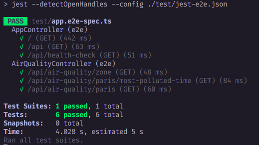

# Air Quality Assessment

The goal of this project is to create a REST API responsible for exposing “the air
quality information” of a nearest city to GPS coordinates using [iqair](https://www.iqair.com/fr/commercial/air-quality-monitors/airvisual-platform/api).

## Technical Stack

Regarding the stack, you'll find:

- [Nest.js](https://nestjs.com) A progressive Node.js framework for building efficient, reliable and scalable server-side applications.

- [MongoDB](https://www.mongodb.com) for the database.

- [Mongoose](https://mongoosejs.com) an elegant mongodb object modeling for node.js, as our Object Document Mapper. 

- [Jest](https://jestjs.io) for unit tests.

- [SuperTest](https://github.com/ladjs/supertest) for integration tests.

- [Docker](https://www.docker.com) for our containerization platform.

## Architecture

Before starting a project, I usually define a certain technical architecture as well as a data model.
This will allow me to organize the code base well and have/keep good consistency.

### Technical Structure

The technical structure of the project is quite intuitive (division into layers/packages) and looks like this :

- `config` that holds app configurations
- `modules` that defines two modules
  - `air-quality` module that handle operations related to air-quality data process
  - `cron-jobs` module that handle project's cron jobs
- `utils` contains utility classes
- `common` contains shared elements (dtos, schemas, etc)

## Tests

Regarding the tests, I was able to implement some of them despite the time constraints. So you'll find :

- For each module, tests for `controllers` and `services`
- Integration or End To End (e2e) tests defined in the `test` directory at the root level of the project.

## Usage

🚨🚨🚨 First and foremost, you'll need to register on [iqair](https://www.iqair.com) and then after create your `API KEY` [here](https://www.iqair.com/fr/dashboard/api). 🚨🚨🚨 

In order to set up & run this project, you can follow one of the two methods below :

**[Side Note]** I'm a huge cloud native enthusiast and a big fan of `containers` and co, so each of the following methods uses `docker`.

### Classic Setup

- First, you'll need to spin up a `Mongo` database instance. To do so, run the following command in order to create
  a fully configured one (you need to have `docker` installed on your system) :
```bash
docker run -d -p 27017:27017 --name air-quality-db mongo
```

- Then, rename the `.env.example` at the root level to simply `.env`

- After that, you can update the `MONGO_URI` value by replace it with `mongodb://localhost:27017/air-quality`

- Edit the `IQAIR_API_KEY` value by your `API KEY` previously created on [iqair](https://www.iqair.com/fr/dashboard/api)

- Finally, you can launch the project by running the command below:
```bash
npm run start
```

- You can visit <http://localhost:3000/api/docs>.

In order to run all unit tests, you can execute the following command :
```bash
npm run test
```

In order to run all integration/end2end tests, you can execute the following command :
```bash
npm run test:e2e
```

For cleaning your environment, you can run :
```bash
docker stop air-quality-db && docker rm air-quality-db
```

### Docker Setup

The full docker setup will consist of a couple of steps :

- First, rename the `.env.example` at the root level to simply `.env`

- Edit the `IQAIR_API_KEY` value by your `API KEY` previously created on [iqair](https://www.iqair.com/fr/dashboard/api)

- Spin up the application by running the following command :
```bash
docker-compose up -d
```

- You can visit <http://localhost:3000/api/docs>.

For cleaning your environment, you can run :
```bash
docker-compose -f src/main/docker/app.yaml down
```

### Tests Results

<table>
<tr>
    <th>Unit Tests</th>
    <th>Integration Tests</th>
</tr>
    <tr>
        <td></td>
        <td></td>
    </tr>
</table>

### API Documentation with Swagger

A documentation of this backend REST API powered by `Swagger` is also available at <http://localhost:3000/api/docs>.


As you can see in the screenshot above, three main endpoints was exposed :

- `/api/air-quality/zone` that return the air quality data of a given zone by providing its coordinates in query params
- `/api/air-quality/paris/most-polluted-time` that return the date and time where the Paris zone is most polluted
- `/api/air-quality/paris` that return all Paris air quality data saved by the cron job which is executed every minutes

## Author

- [Meïssa B.C MBAYE](https://www.linkedin.com/in/meissa-bc-mbaye/)
